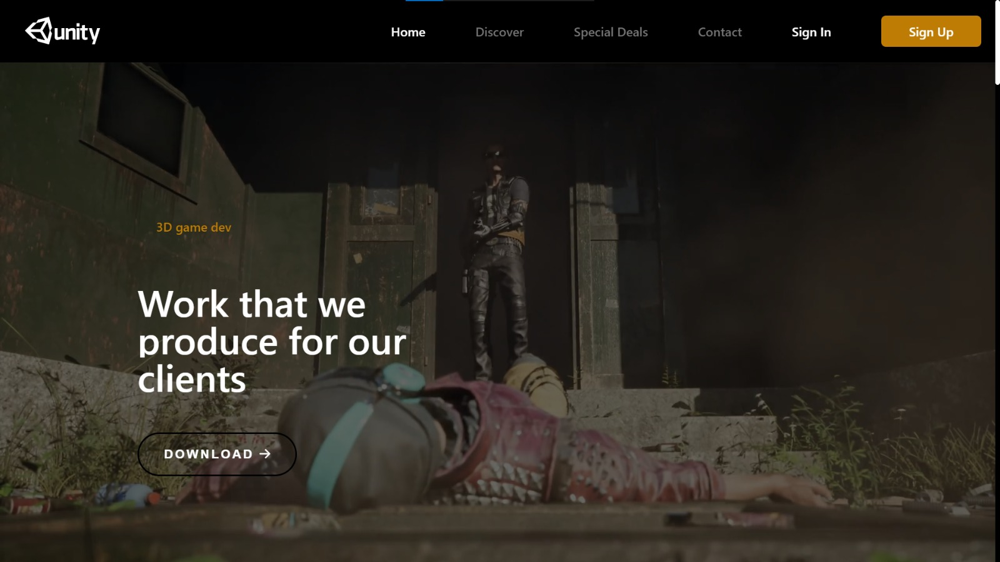

# Unity Game Development Website
 Unity Game Development Website is your all-in-one platform for creating, collaborating, and sharing Unity game projects with ease.Experience seamless game development with integrated tools, real-time collaboration, and deployment support for developers of all levels.
 



https://github.com/Sa2003hil/Unity/assets/115913715/2af9060d-09dc-4921-8a03-4d4e07ba6a67


## Table of Contents
- [Introduction](#introduction)
- [Features](#features)
- [Technologies Used](#technologies-used)
- [Getting Started](#getting-started)
  - [Prerequisites](#prerequisites)
  - [Installation](#installation)
- [Usage](#usage)
- [Contributing](#contributing)
- [License](#license)

## Introduction
Welcome to the Unity Game Development Website, a professional platform for game developers built with a modern tech stack. This website is designed to support game developers in creating, sharing, and collaborating on Unity game projects. Whether you are a seasoned developer or just starting out, our platform offers a comprehensive set of features to help you succeed in your game development journey.

## Features
- User account creation and management
- Project creation and management
- Collaboration tools for team-based development
- Unity project integration
- Real-time chat and discussion boards
- Secure file hosting and sharing
- Game deployment and publishing support

## Technologies Used
This project leverages the following technologies:
- **Frontend**:
  - React: A popular JavaScript library for building user interfaces.
  - Vite: A fast and efficient JavaScript build tool.
  - React Router: For handling routing within the application.
  - Axios: A promise-based HTTP client for making API requests.

- **Backend**:
  - Node.js: A runtime environment for executing JavaScript on the server.
  - Express.js: A web application framework for Node.js.
  - MongoDB: A NoSQL database for storing user data and project information.

## Getting Started

### Prerequisites
Before you begin, ensure you have met the following requirements:
- Node.js and npm (Node Package Manager) installed on your development machine.
- MongoDB installed and running.

### Installation
1. Clone this repository to your local machine:
   ```sh
   git clone https://github.com/sa2003hil/unity.git
   
2. Navigate to the project directory:
     ```sh
   cd unity

3. Start the development server for the frontend and backend:
     ```sh
   # Frontend (in the client directory)
    npm run dev

    # Backend (in the root directory)
    npm start

### Contributing
We welcome contributions from the community. If you'd like to contribute to this project, please follow our _**Contribution Guidelines.**_
